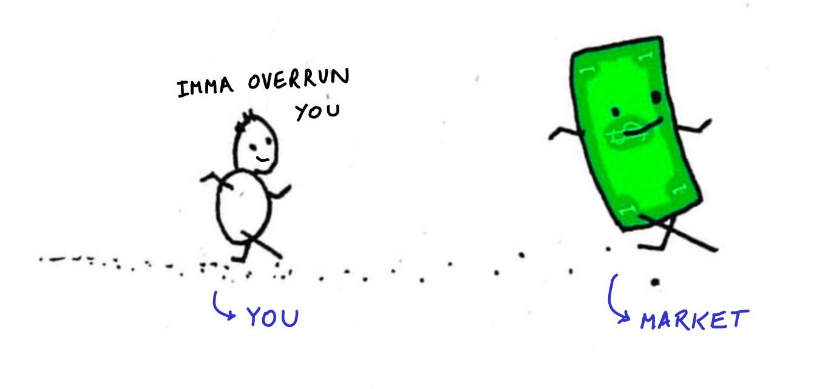
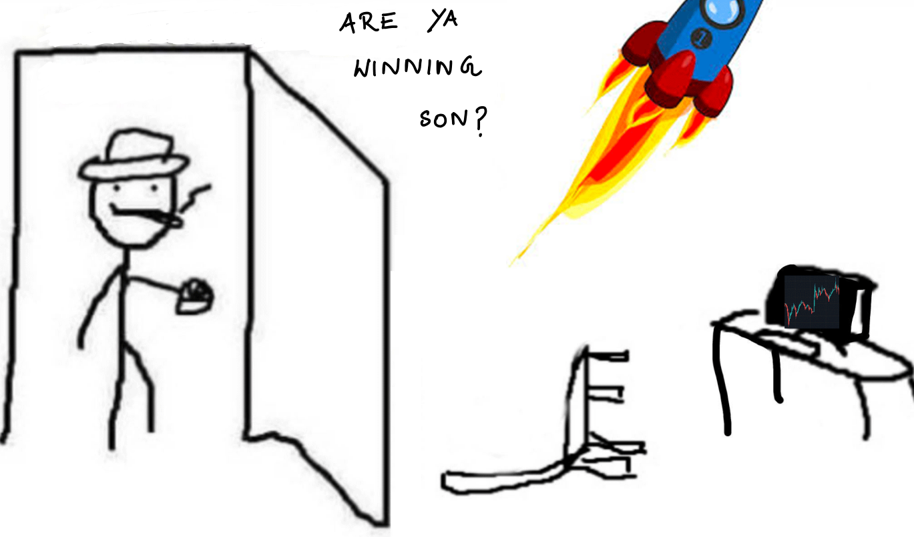

# Faraday

Faraday is an educational website for financial markets where people can learn about stocks and practice on an online simulator. They can also participate in real-time trading contests as well as on modified or historical data.

### Why Faraday?

We believe that every individual should have a broad understanding of how financial markets work, due to their heavy influence on our day-to-day lives. However, getting started with stock market poses a high entry barrier to beginners, especially because they have to put real money on the line. This leads to a lot of reluctance towards entering the domain. And this is exactly what we are determined to change,

We wish to provide a platform to attract beginners by allowing them to participate in the markets' craze and get their hands dirty with virtual money. Thus, they need not put their real money on the line and still be able to learn.

However, Faraday is a lot more than a learning platform, as we ascribe below.

### What does Faraday offer?

> “What good is it?” 
Faraday replied: “What good is a baby?” 
Or maybe he said: “Soon you will be able to tax it.”
> 

Faraday's main aim is to provide a real time stock market simulator with virtual money to users so that they can freely get the hang of the stock market's dynamics without worrying about losing money. But it doesn't end here. We have a lot more to provide. 

- Users can start learning modules provided by us to gain further insights into the world of the stock market, from jargon to some common strategies. These modules not only provide high quality notes but also interactive exercises for the  user to be able to judge his understanding of the subject.
- Simulating only the current market might be a slow learning process and we want to provide the users a wide range of historical scenarios where the market was in dire conditions, for example the 2008 financial crisis, COVID outbreak in March 2019. These will help the user analyze their strategies in the extreme cases also and make necessary modifications to the same. Specific contests can also be designed to get the most out of such such scenarios and historical data.
- Spending time by just trading with virtual money might become boring. So we also let the users compete against each other by offering live contests, where there is only one objective: make a HELL lot of money. The leaderboards in these contests will drive the participants to continuously work harder in building more profitable strategies and spice up their learning process.
- We further intend to utilize the platform and its active users into creating a community where users can choose to discuss their strategies, ideas and failures on a dedicated forum.
- We don't want our users to have to manually punch trades everytime by opening the browser, especially the eager programmers who are always looking for ways to automate stuff. For this we also provide the programmers with an API access. What would the API offer them :
    - Access to real time data 
    - Order placement 
    - User's statistics like their current cash, holdings etc.
    
    This automation means that users can now program their strategies. This feature would be very beneficial given the large amount of people that are now turning towards algorithmic trading. 
    
    A potential add-on to this can be SDK's in the most used programming languages like Python, Javascript, Go etc.
    

## Implementation

There are two major use cases that we provide. The first one is the stock trading simulator while the second one involves the learning modules.

- First, we will shed light on what we plan to do with the Trading Simulator. There are multiple contests that will be running at any point of time, these can be either live or based on certain historical scenarios. A user can register himself in any on these contests if he chooses to participate.
- Upon registration, the user receives 100,000 credits (equivalent to one lakh rupees) which they can use only for this contest. Then they are displayed a collection of stocks which this contest allows you to trade in. The user can now view the charts of any of these stocks. They can now start trading by placing orders against any stock and grow their portfolio.
    
    As the user's returns start increasing, they also start climbing the leaderboard, hence instilling confidence in the user to start trading in the real markets and also at the same time alerting the poor performers to stay away from the real markets as their strategies are not profitable
    
- Finally, we have Learning Modules which are aimed to make the complete beginners less intimidated by the pool of jargon that the financial world uses. We plan to structure the content in such a way that can cater to even the non financial background people. The modules not only contain just plain notes but are also to be equipped with interactive exercises for the users.
- The realm of Learning Modules do not end with just exploring finance. We also plan on providing elaborate reading and interactive content for the several mathematical and algorithmic domains which serve as the very backbone of Financial Engineering.

### Technologies Used

- Python 3, JavaScript
- Frameworks Used: Flask, MongoDB, React
- Google Cloud for hosting the bot on a virtual machine

### Basic Working Version

As the time for the hackathon was limited, only a basic working version was created.

This version supports:

- Learning Modules
    - Candle Plots
    - Trading Psychology
    - Quantitative Trading Strategies
    - Mathematics and Algorithms
- Contests
    - Users can participate in contests
    - Leaderboards
    - Contests can be historical as well as live
